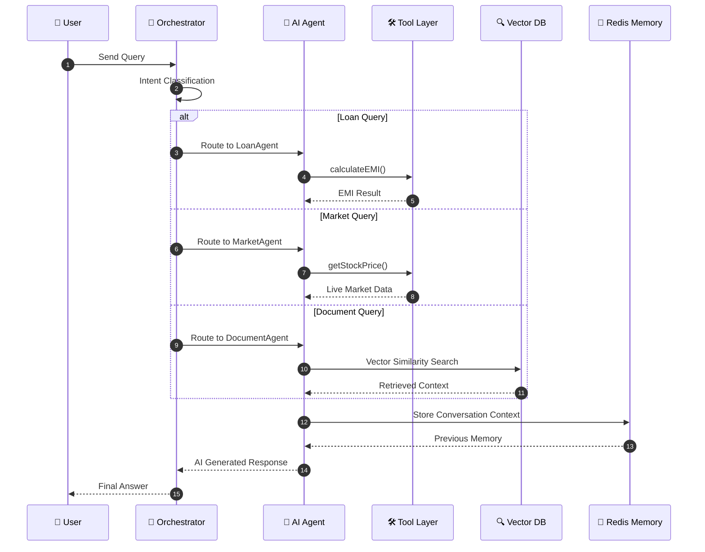
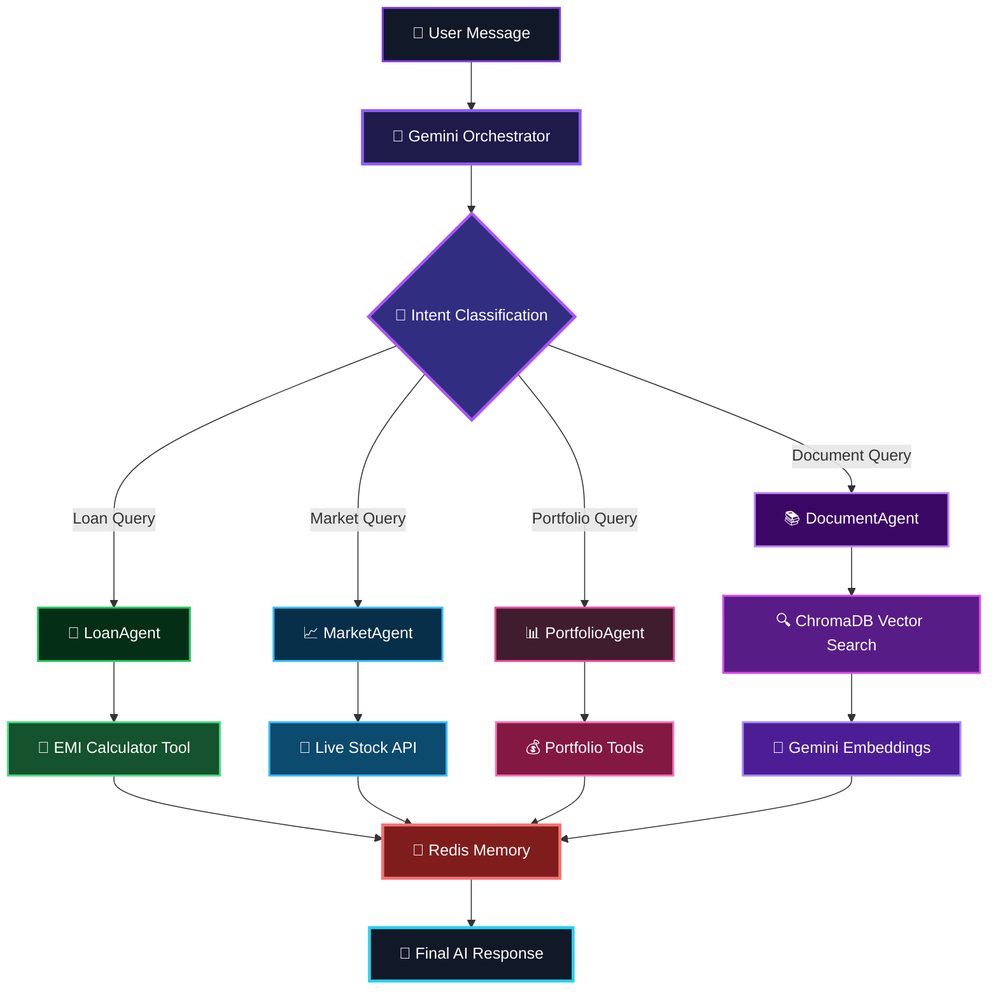

<div align="center">


<br/>

[](https://nodejs.org)
[](https://nestjs.com)
[](https://typescriptlang.org)
[](https://redis.io)
[](https://trychroma.com)
[](https://ai.google.dev)

<br/>

> **Production-grade multi-agent fintech AI system featuring LLM orchestration, tool calling, RAG pipelines, vector search, Redis conversational memory, and cross-agent reasoning.**

<br/>

[](LICENSE)
[](CONTRIBUTING.md)
[](https://github.com/tarunsingh)

</div>

---

# 🎥 Multi-Agent Workflow
<div align="center">

### 🧠 AI Request Lifecycle



</div>

---

# 🧠 System Architecture
<details>
<summary>ASCII Architecture</summary>

```text
POST /chat  { sessionId, message }
                      │
                      ▼
        ┌─────────────────────────┐
        │       ORCHESTRATOR      │
        │   Gemini AI — Router    │
        │  Zero hardcoded keywords│
        │  Pure LLM intent routing│
        └────────────┬────────────┘
                     │
       ┌─────────────┼──────────────┬─────────────┐
       ▼             ▼              ▼             ▼
 ┌──────────┐ ┌───────────┐ ┌──────────┐ ┌────────────┐
 │ 🏦 Loan  │ │📊Portfolio│ │📈 Market │ │📚 Document │
 │  Agent   │ │  Agent    │ │  Agent   │ │   Agent    │
 │ EMI Calc │ │ Portfolio │ │  Stock   │ │  RAG       │
 │  Tool    │ │ Fund Tools│ │Price Tool│ │  Search    │
 └────┬─────┘ └─────┬─────┘ └────┬─────┘ └──────┬─────┘
      │              │             │              │
      │              │             │       ┌──────▼──────┐
      │              │             │       │  ChromaDB   │
      │              │             │       │Vector Search│
      │              │             │       │Gemini Embed │
      │              │             │       │text-embed   │
      │              │             │       │-004         │
      └──────────────┴─────────────┴───────┴──────┬──────┘
                                                   │
                                    ┌──────────────▼──────────┐
                                    │       Redis Memory       │
                                    │  Per-session history     │
                                    │  Persists across calls   │
                                    └─────────────────────────┘
```

</details>

---

# ⚙️ End-to-End Execution Flow

<div align="center">



</div>

---

# 🛠️ Tech Stack

| Layer | Technologies |
|---|---|
| Backend | Node.js, NestJS, TypeScript |
| AI Layer | Gemini AI |
| Vector Database | ChromaDB |
| Memory Layer | Redis |
| Embeddings | Gemini text-embedding-004 |
| APIs | REST |
| Architecture | Multi-Agent System |
| Retrieval | RAG Pipeline |
| Infra | Docker-ready |

---

# 🎯 Why This Project Matters

This project demonstrates how modern AI systems move beyond simple chatbot interactions into production-grade autonomous workflows.

The system combines:

- LLM orchestration
- dynamic tool execution
- retrieval-augmented generation (RAG)
- vector similarity search
- conversational memory
- cross-domain reasoning

to simulate real-world fintech AI assistants operating at scale.

---

# ✨ Features

```text
🧭  AI-powered routing      Zero hardcoded keywords — Gemini classifies intent
🛠️   Tool calling            Agents execute real functions dynamically
🧠  RAG Pipeline            Semantic document retrieval using vector search
📐  Text Embeddings         Gemini text-embedding-004 converts text → vectors
🗄️   Vector Database         ChromaDB stores and retrieves embeddings
🔖  Source Citation         Grounded responses with document references
💾  Persistent Memory       Redis-backed conversational memory
🔁  Exponential Backoff     Automatic retry handling for LLM failures
⚡  Multi-tool Loop         Multiple sequential tool invocations
🌐  Production REST API     NestJS API with validation and session handling
🧩  BaseTool Pattern        Plug-and-play tool abstraction architecture
```

---

# 🏭 Production Engineering Highlights

- Stateless REST APIs with session-based conversational memory
- Redis-backed distributed chat persistence
- Exponential retry handling for LLM failures and rate limits
- Modular tool abstraction for rapid agent expansion
- AI-first orchestration with zero keyword routing
- Retrieval-Augmented Generation (RAG) with semantic vector search
- Cross-agent contextual reasoning
- Multi-tool execution loop for compound requests
- Strong separation between orchestration, tools, memory, and retrieval layers

---

# 🤖 Agents

## 🏦 LoanAgent — Real EMI Calculations

```text
User: "What's my EMI for a 40L home loan at 8.5% for 20 years?"
         │
         ▼
calculateEMI(4000000, 8.5, 20)
         │
         ▼
{ emi: 34713, totalInterest: 4331120, totalPayment: 8331120 }
         │
         ▼
"Your EMI is ₹34,713/month"
```

---

## 📊 PortfolioAgent — Mutual Fund Portfolio

```text
User: "Show my portfolio"
         │
         ▼
getPortfolio("user_001")
         │
         ▼
₹3,12,500 current value
+25% overall returns
```

---

## 📈 MarketAgent — Live NSE Stock Prices

```text
User: "Compare Wipro and TCS"
         │
         ▼
getStockPrice("WIPRO")
getStockPrice("TCS")
         │
         ▼
AI-generated comparison response
```

---

## 📚 DocumentAgent — RAG Pipeline

```text
User: "Can banks charge prepayment penalty?"
         │
         ▼
embed(query)
         │
         ▼
ChromaDB similarity search
         │
         ▼
Retrieve RBI guidelines
         │
         ▼
Gemini generates grounded answer
```

---

# 📄 Document Knowledge Base

| Document | Category |
|---|---|
| RBI Guidelines on Loan Prepayment | RBI Guidelines |
| SEBI Mutual Fund Regulations | SEBI Regulations |
| Personal Loan Eligibility Criteria | Loan Policy |
| Home Loan Tax Benefits | Tax Benefits |
| Mutual Fund Taxation | Tax Benefits |
| Understanding CIBIL Score | Credit Score |
| Benefits of SIP Investment | Investment |

---

# 📺 Runtime Demonstration

| Tool Calling | RAG Retrieval |
|---|---|
|  |  |

---

# 💬 Real Conversation Examples

```text
👤 EMI for 10 lakh at 9% for 5 years?
🧭 → LoanAgent
🤖 Your EMI is ₹20,758/month.

👤 Show me my portfolio
🧭 → PortfolioAgent
🤖 Portfolio: ₹3,12,500 (+25%)

👤 What is TCS stock price?
🧭 → MarketAgent
🤖 TCS: ₹2,264.00 ▲ ₹18 (+0.80%)

👤 Can banks charge prepayment penalty?
🧭 → DocumentAgent
🤖 RBI mandates banks cannot charge penalties
```

---

# 🚀 Quick Start

## Prerequisites

- Node.js 18+
- Python 3.9+
- Redis
- Gemini API Key

---

## Installation

```bash
git clone https://github.com/yourusername/fintech-ai-agent.git

cd fintech-ai-agent

npm install

pip3 install chromadb

cp .env.example .env
```

---

## Start Services

```bash
# ChromaDB
chroma run --host localhost --port 8000

# Redis
brew services start redis

# Ingest documents
npm run ingest

# Start API
npm run api
```

---

# 📡 API Reference

## POST /chat

```bash
curl -X POST http://localhost:3000/chat \
  -H "Content-Type: application/json" \
  -d '{
    "sessionId": "user_001",
    "message": "Can banks charge prepayment penalty on my home loan?"
  }'
```

---

## DELETE /chat/:sessionId

```bash
curl -X DELETE http://localhost:3000/chat/user_001
```

---

## GET /health

```bash
curl http://localhost:3000/health
```

---

# 🏗️ Project Structure

```text
fintech-ai-agent/
├── src/
│   ├── agents/
│   ├── tools/
│   ├── rag/
│   ├── memory/
│   ├── chat/
│   ├── utils/
│   └── app.module.ts
├── assets/
├── package.json
├── tsconfig.json
└── README.md
```

---

# 🧩 Key Concepts Implemented

| Concept | Implementation |
|---|---|
| LLM Tool Calling | Dynamic tool invocation |
| Multi-Agent Architecture | AI-powered routing |
| RAG Pipeline | Retrieval → Context → Answer |
| Text Embeddings | Gemini embeddings |
| Semantic Search | Vector similarity retrieval |
| Conversation Memory | Redis session persistence |
| Exponential Backoff | Retry handling |
| Cross-Agent Reasoning | Shared conversational context |

---

# 🔮 Future Improvements

```text
[ ] SIP recommendation agent
[ ] Docker Compose setup
[ ] Streaming responses
[ ] Swagger documentation
[ ] Unit & integration tests
[ ] Rate limiting
[ ] Kubernetes deployment
```

---

# 🛡️ Resilience Patterns

```javascript
await withRetry(
  () => chat.sendMessage(userMessage),
  {
    maxRetries: 3,
    baseDelayMs: 2000,
  }
);
```

---

<div align="center">

## Built By Tarun Kumar Singh

Senior Backend Engineer · AI Systems · Distributed Infrastructure · Fintech

<br/>

[](https://linkedin.com)
[](https://github.com/tarunsingh)

<br/>


</div>
